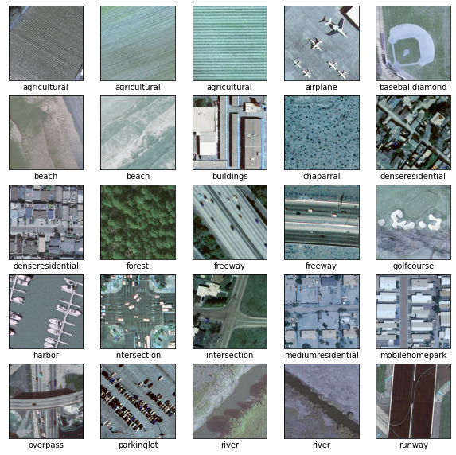
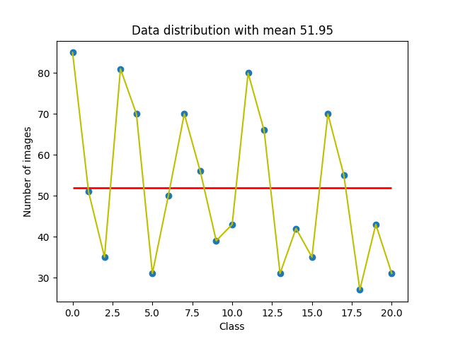
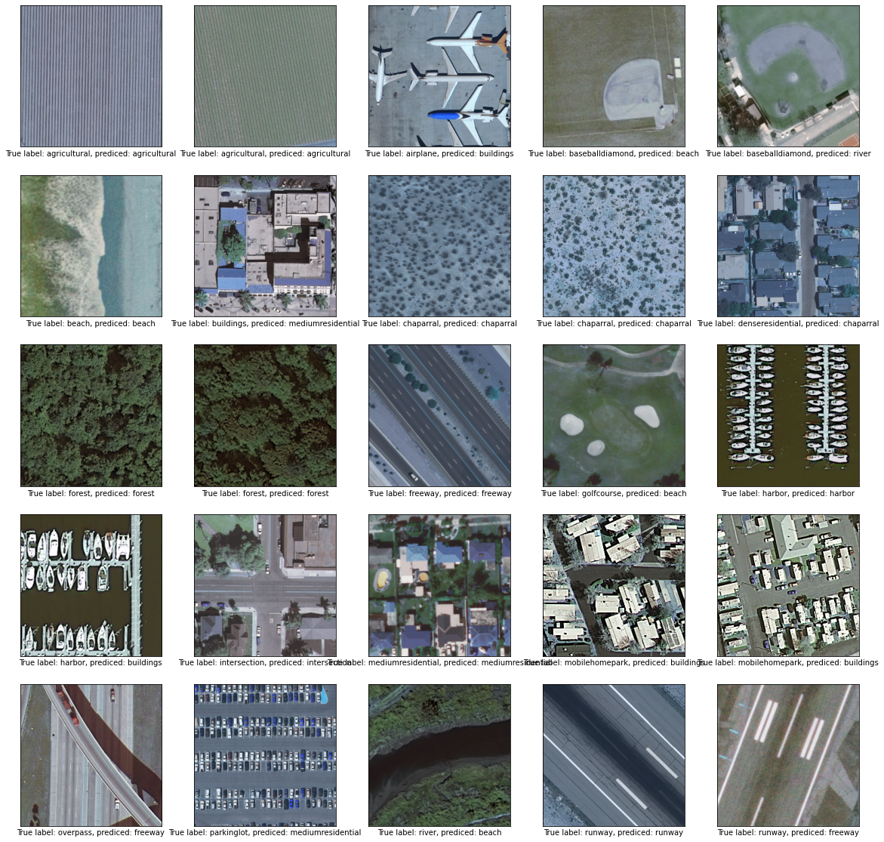
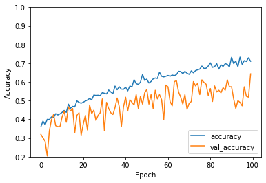
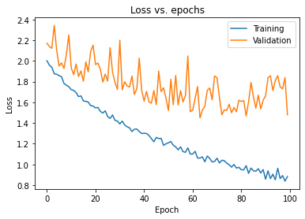
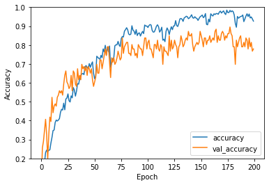
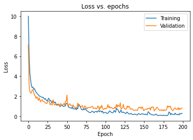

# Remote-Sensing-Images-Classification

## Installation
```
git-lfs clone git@github.com:qiaw99/Remote-Sensing-Images-Classification.git
```
*Notice that git might not be enough, because data stored in \*.npy and \*.zip files exceed the limitation of git(100MB). So please instead using [git-lfs](https://git-lfs.github.com/).*

## Environment
Windows, Google Colab with GPU, TensorFlow version: 2.8.0

## Overview
* Report
    * [Project structure](#44)
    * [Getting data](#40)
    * [Experimental setup and baseline](#41)
    * [Evaluation](#43)

<h2 id=44> The whole project structure should be like this: </h2>

```
- Challenge_dataset
    - train
    - test
    - train.npy
    - test.npy
    - checkpoints
        - checkpoint
        - my_checkpoint.data-00000-of-00001
        - my_checkpoint.index
```

## Evaluation of model

<div>
  <a href="https://github.com/qiaw99/Remote-Sensing-Images-Classification/actions"></a>
</div>

If you just want to see how good this model works, you can check it by [pipeline](https://github.com/qiaw99/Remote-Sensing-Images-Classification/actions). However, if you would like to test the model on your own data, you could use __**evaluation.ipynb**__ and replace the corresponding *.npy files. If you want to do it convenientlly, we can execute __code_challenge.ipynb__ but you have to structure your project like [this](#44). The training happens in __code_challenge.ipynb__, so you could see all the details there. In __model.ipynb__, only the process is provided but the model has not been trained.  *__Note: do not use evaluate.py for evaluation. This is only for pipeline!__* 

# Pipeline:
## Testing environment: 
Ubuntu 18.04, Tensorflow 2.8.0.

**Problem:**
I met the problem that in pipeline, __*.npy__ files cannot be correctly read, see [issue here](https://github.com/qiaw99/Remote-Sensing-Images-Classification/issues/1). The solution is, by using package [gdown](https://github.com/wkentaro/gdown) to download them directly from Google Drive:
``` yml
gdown folder_address -O /tmp/folder --folder
gdown file_id
```


#  Introduction
This is a **Coding Challenge from Project CV4RS at TU Berlin.** Data consists of 1091 training data and 279 testing data which are from 21 different classes:
```py
class_names = [
'agricultural', 'airplane',                  'baseballdiamond', 'beach', 
'buildings','chaparral', 
'denseresidential', 'forest', 
'freeway', 'golfcourse',
'harbor', 'intersection', 
'mediumresidential', 'mobilehomepark',
'overpass', 'parkinglot', 
'river', 'runway', 'sparseresidential',
'storagetanks', 'tenniscourt']
```
However, during preprossing step, it was figured out that not all data can be used. Most of data have shape: (256, 256, 3). But some of data have different size(smaller than 256 * 256). In principle, we can interpolate some values(bilinear interpolation) to those images so that they could become same size as the most images. However, I would just discard them.

# Report 
<h2 id=40> 1. Get data:</h2> 

1. Initially, I only get raw data in zip file(which you can find it in folder **data**) downloaded from [Google Drive](https://drive.google.com/file/d/1zVkU9eMuerAJ_lbC2Uj8mAcn6rueuAK7/view?usp=sharing). You should extract zip file as one folder and should have the following file-structure:
    ```
    - Challenge_dataset
        - train
            - agricultural
                - agricultural00.tif
                - ...
            - airplane
                - ...
            - ...
        - test
            - agricultural
                - agricultural00.tif
                - ...
            - airplane
                - ...
            - ...
    ```
    * __Preprocessing image data:__ 
```py

import cv2 as cv
from skimage import io

X = []
y = []
error = []
counter = 0

for c in class_names:
  os.chdir(os.getcwd() + "/" + c)
  print(os.getcwd())
  files = os.listdir(os.getcwd()) 
  print(files)
  for file in files: 
    img = cv.imread(file)
    if(img.shape == (256, 256, 3)):
      X.append(img)
      y.append(counter)
    else:
      error.append(c + file)
  os.chdir(os.path.abspath(os.path.join(os.path.dirname("__file__"),os.path.pardir)))
  print(os.getcwd())
  counter += 1
```
We can read all images with help of opencv and store those images as numpy arrays in shape of (256, 256, 3). As we go through all subfolders of **train**, we  should also annotate the corresponding label to each image using index of range from 0 to 20 standing for each class as mentioned before. In error, we could see the images whose shape differ from others.

With that, we can virtualize some of images: 
```py
plt.figure(figsize=(10,10))
for i in range(0, 25):
    plt.subplot(5,5,i+1)
    plt.xticks([])
    plt.yticks([])
    plt.grid(False)
    plt.imshow(X[i*40])
    plt.xlabel(class_names[y[i*40]])
plt.show()
```


 However, this data cannot directly be used for training and evaluation, you should normalize them firstly before use: 
```py
# Normalize pixel values to be between 0 and 1
X = X / 255.0
```

2. Alternatively, you could use data that I've preprocessed which is located in folder **data-in-numpy**. In it, the structure is as following: 
    ```
    - data-in-numpy
        - test.npy
        - train.npy
    ```
    You should put them into folder **Challenge_dataset**. The training data has size: **(1076, 256, 256, 3)** and testing data has size **(276, 256, 256, 3)**. Then you could reload the data with help of two npy files: 
    ```py
    with open("test.npy", "rb") as f:
        X_val = np.load(f)
        y_val = np.load(f)

    with open("train.npy", "rb") as f:
        X = np.load(f)
        y = np.load(f)
    ```

X, y are all data for training which we have to split them into traing data and validation data(80/20%) before we can really start training our model. In this case, I would use the predefined function from sklearn: 
```py
from sklearn.model_selection import train_test_split

X_train, X_test, y_train, y_test = train_test_split(X, y, test_size=0.2)
```
<h2 id=41>2. Experimental setup and baseline </h2>

### __2 a)__
Now, we should look into the data itself. 


The x-axis stands for each corresponding class and y-axis stands for the number of images contained in each subfolders. Observe that the data is not so equally distributed. The average number of images is __51.95__ as in the figure listed. Furthermore, we see that the variance of data is quite large which means __the data distribution is not balanced!__

### __2 b)__
The exact model will be discussed in the next part. 

### __2 c)__ 
A baseline model should be established. I would briefly explain my initial idea if I would implement a model for classfication task. In tradition the first choice to handle image problems is of course using __Convolutional Neural Network(CNN)__ by executing a series of convolutions and pooling operations which is ended by a set of __fully connected layers__ for classifications. However, we might encounter problems like vanishing or exploding gradients. Provided that the CNN is relatively shallow,  we may use __Batch Normalization__ or __Layer Normalization__ to fix it. But what if we just keep stacking more and more convolutional and pooling layers? With the increasing number of layers, the performance(accuracy) gets saturated which is not caused by overfitting. Since the given classification problem consists of 21 classes, I decided to use __ResNet 50__ which was in 2015 proposed by __Kaiming et. al__. ResNet can solve this problem by stacking multiple identity blockes which refer to short cut and convolutional blocks. 

__Improvements:__
* Within model: ResNet uses already Batch Normalization. What's more, we could use __dropout__ and __data augmentation__ like __clipping, rotation__, etc to generate more data letting model see more images with different orientation to better get generalized so that the model can become more stable to unseen images.
* For model: In recent year, __transformer__ using __Attention mechanism__ which was published in 2017 is proven as really well performance model in the field of __Natural Language Processing(NLP)__. Recently, transformer is used also in the field of Computer Vision as __vision transformer(ViT)__ which is published in 2020 by putting more information(patch and position embedding). Thus, I would believe that using ViT would be a good way to improve if the given number of training images are enough much. 

### __2 d)__
The evaluation metrics for classification is commonly computing __the cross entropy loss between the labels and predictions__.

<h2 id=43> 3. Build and train the model</h2>

1. model.ipynb


2. Use the trained model from me: 
    All weights are stored in folder **checkpoints**. You should put this entire folder into **Challenge_dataset**. 
    * Build a model(details will be explained afterwards). 
```py
# Instantiate the ResNet50 model
conv_base =tf.keras.applications.resnet.ResNet50(input_shape=(256, 256, 3),
                          include_top=False,
                          weights='imagenet')

# freeze the layers
for layer in conv_base.layers:
  layer.trainable = False

names = []
for layer in conv_base.layers:
  names.append(layer.name)

names[-1] # getting the name of the last conv layer

last_layer = conv_base.get_layer('conv5_block3_out')
print('last layer output shape: ', last_layer.output_shape)
last_output = last_layer.output

inputs = Input(shape = (256, 256, 3))
x = conv_base(inputs)
x = GlobalAveragePooling2D()(x)
x = Flatten()(x)
# Add a fully connected layer with 512 hidden units and ReLU activation
x = Dense(512, activation='relu')(x)
# Add a final softmax layer for classification
output = Dense(len(class_names), activation='softmax')(x)

model = Model(inputs, output)
```
I've decided that for convolutional part, the pretrained ResNet50 will be used which we can download it from keras application. For transfer learning, we should freeze all layers contained in ResNet50. After the last layer from ResNet, we have to do __GlobalAveragePooling__ once and flatten the output array so that we can pass them to __fully connected layers__ which are consist of 512 units layer and 21 units layer for classification. 

### __Hyperparameters:__
- Number of epochs: 100
- Learning rate: 0.001

All weights of trained model are store as checkpoint located at folder __checkpoints__ which you shouldn't modify. With checkpoint, you could rebuild the same model in tensorflow as follow:

1. Goto the correct parrent folder:
```py
os.chdir("drive/MyDrive/Challenge_dataset/")
```
2. Define the model correctly as mentioned before
3. Then you could reload weights of the model: 
```py
model.load_weights('./checkpoints/my_checkpoint')
```
With this model, you could now to __predict__ the image class like this: 
```py
classif_prob = model.predict(X_val)
pred_classes_argmax = np.argmax(classif_prob,axis=-1)
predicted_cls = pred_classes_argmax[0]
print("Predicted class:", predicted_cls)

> Predicted class: 0
```
Since softmax function gives us the probabilities of all classes, we should choose the class that possesses the highest probiblity among all of them and return the corresponding index(class). 

## 4. Evaluation
The pretrained model cannot be directly used for evaluation, but rather firstly compile them: 
```py
from tensorflow.keras.optimizers import RMSprop

# compile the model
model.compile(optimizer=RMSprop(lr=0.001),
            loss='SparseCategoricalCrossentropy',
            metrics=['accuracy'])
```
After that, you can try to evaluate it: 
```py
values = model.evaluate(X_val, y_val)
print("{}:{},{}:{}.".format(model.metrics_names[0],values[0],model.metrics_names[1],values[1]))

> 9/9 [==============================] - 59s 6s/step - loss: 3.2318 - accuracy: 0.4167
loss:3.2318239212036133,accuracy:0.4166666567325592.
```

We can plot some images to check the true labels and the predicted labels: 
```py
plt.figure(figsize=(20,20))
for i in range(0, 25):
    plt.subplot(5,5,i+1)
    plt.xticks([])
    plt.yticks([])
    plt.grid(False)
    plt.imshow(X_val[i*10])
    plt.xlabel("True label: " + class_names[y_val[i*10]] + ", prediced: " + class_names[pred_classes_argmax[i*10]])
plt.show()
```
 

It's a little bit unclear, but you could find this image [here](https://github.com/qiaw99/Remote-Sensing-Images-Classification/blob/main/img/predicted.png)




From both figures we can observe that, the accuracy keeps increasing as epochs getting larger and in contrast, the loss keeps decreasing. You can see the final result in __code_challenge.ipynb__: 
```py
Epoch 100/100
27/27 [==============================] - 11s 394ms/step - loss: 0.8822 - accuracy: 0.7105 - val_loss: 1.4790 - val_accuracy: 0.6435
```
In the end, we get accuracy for training 71% and for validation 64% which is pretty good. The final test accuracy is only 41% unfortunately. There is a gap between the validation accuracy and test accuracy.  Even if I would get involved into more deeper model - __ResNet 152__ and tried different optimizers to get rid of local optima, the accuracy cannot significantly be improved. I infer the problem  is that I transfer the image into 3 channels(for easy training). However, if the number of channels increases, the performance should be in some sense improved.

## 5. Update
### Vision-Transformer


Since I've trained this model yesterday[24.04], I don't have that time to write report for that. 




As you can see, transformer has archieved a better performance even the number of training data is same: 
```py
13/13 [==============================] - 5s 382ms/step - loss: 0.3410 - accuracy: 0.9044 - top-5-accuracy: 0.9910 - val_loss: 1.3236 - val_accuracy: 0.6860 
Test accuracy: 68.06%
```

Although the accuracy is improved only by around 4%, but if we could generate more image data using data augmentation e.g. __ImageDataGenerator__ defined in __tensorflow.keras.preprocessing.image__ like this:
```py
# create an image generator instance
train_datagen = ImageDataGenerator(preprocessing_function=preprocess_image_input,
    rotation_range = 30,
    width_shift_range = 0.2, 
    height_shift_range=0.2,
    shear_range=0.2,
        zoom_range=0.2,
        horizontal_flip=True,
        fill_mode='nearest')

train_generator =  train_datagen.flow_from_directory(
        # target directory
        train_dir,
        # All images will be resized
        target_size=(IMAGE_WIDTH, IMAGE_HEIGHT),
        batch_size = BATCH_SIZE,
        # Since we use categorical_crossentropy loss, we need categorical labels 
        class_mode='categorical')
```
So when we train the model, we can just pass generator to it instead of X_train, y_train. 

If you would like to rebuild the model, you can find all weights [here](https://drive.google.com/drive/folders/12C-V5dTt2uckGNNcOuBBFGmGmL10dIVy?usp=sharing), because this weight file is too big to upload to github so I would rather store them in Google Drive. 


